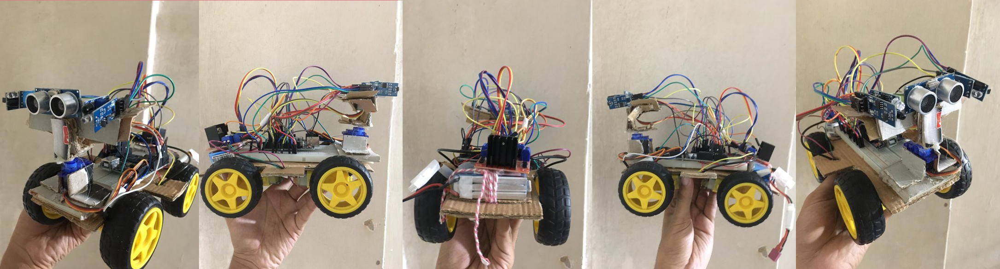
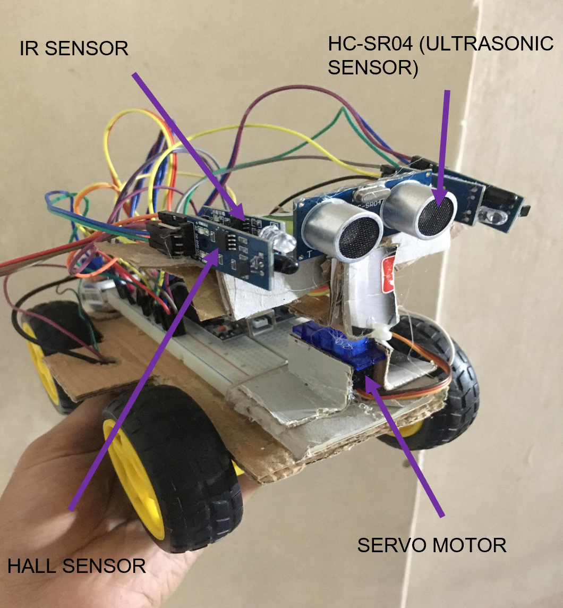
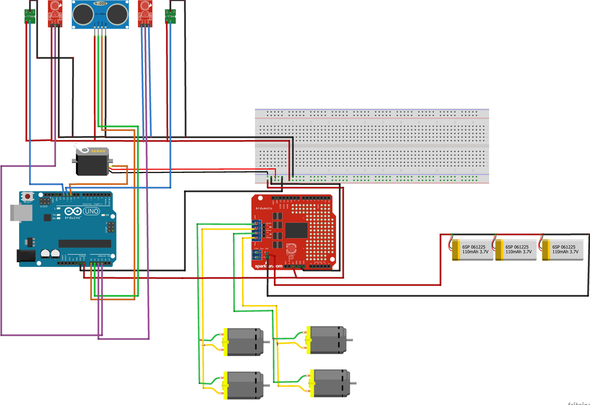

# Object-Following-Robot
A robot that follows object infront of it while avoiding others. The robot is shown below

Figure: Object following robot

The object can follow objects in front of it. The demo video link: https://www.youtube.com/shorts/12ys0GQt_b4

The robot can follow a particular object. It follows the one with magnet. The demonstration video link: https://www.youtube.com/shorts/t0yJnuuZuMA

The sensors and componenets used for this robot are : 
* IR sensor (x2)
* Hall Sensor (x2)
* Ultrasonic sensor (HC-SR04) 
* Li-Po battery
* Arduino Uno
* L298N motor driver
* Breadboar
* Servo motor
* Wheels
* Jumper wire
* magnet

The sensors are marked in the following figure:

Figure: Sensors used in the robot

The circuit of the system is shown in the following figure:

Figure: Circuit of system

<b>The Design Strategy:</b>

<i>Forward Movement:</i> We have used HC-SRO4 sonar sensor to detect any object in front     of the car. If the distance measured by HC-SRO4 lies within 10-20 cm , the car moves  forward otherwise the car remains standstill.

<i>Left/right movement:</i> The left/right movement of the car ensure by detecting object     movement through IR sensor . When the followed object moved right/left  , one of the two IR sensors receive signal and the car moves in the corresponding direction.

<i>Selective Tracking:</i> When we want to track an object selectively, we can mount a magnet on it. The hall sensor senses magnetic field and the car follows the magnetic ignoring any signal received from IR sensor.

<i>Neck Rotation:</i> A servo motor is used to rotate the neck of the car

